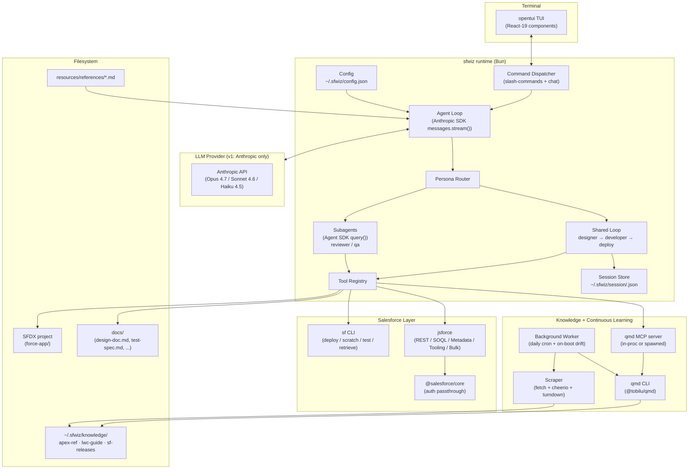

# Phase 2 — Planning

Status: **complete**. Next: `phase-3-poc.md`.

Source of truth for architecture. Re-open this at every session.

## 1. High-level architecture



## 2. Module breakdown

| Module | Responsibility |
|--------|----------------|
| `tui/` | opentui (React-19) components, keybinding map, panel layout, status line |
| `dispatcher/` | Parse input → slash-command OR chat; route to agent loop or direct command handler |
| `agent/` | Streaming agent loop, tool-call handling, message history, token accounting |
| `personas/` | 6 persona prompts + tool-scope allowlists. Hybrid invocation: shared vs isolated |
| `router/` | Given a task + current state, pick next persona. Implements feedback-loop auto-redispatch |
| `tools/` | Registry + concrete implementations. Grouped: `fs`, `shell`, `sf-cli`, `jsforce`, `metadata`, `settings`, `soql`, `apex`, `lwc` |
| `sf/` | Salesforce adapters: auth (`@salesforce/core`), org-list, `sf` CLI wrappers, jsforce client factory, metadata-umbrella extractor, 42-type settings registry |
| `llm/` | `@anthropic-ai/sdk` client + `messages.stream()` wrapper for the main loop; Anthropic-only model catalog (Opus 4.7 / Sonnet 4.6 / Haiku 4.5) + first-run model picker; cache_control hint helpers; token tracker. Multi-provider deferred to v2. Subagents use `@anthropic-ai/claude-agent-sdk` `query()` directly from `agent/subagents.ts`. |
| `session/` | Conversation persistence, hash-keyed sessions, 30-day TTL, `/resume` support |
| `config/` | Zod schema for `~/.sfwiz/config.json`, env-var overlay, first-run bootstrap |
| `resources/` | Bundled reference MDs (10 ported from plugin), persona prompts, scratch-org templates |
| `knowledge/` | qmd lifecycle (install detect, collection add, update, embed), MCP wiring, query wrapper. Read-only at runtime. |
| `learn/` | Continuous-learning worker: scraper, season detector, HEAD-diff cache, scheduler. Writes to `~/.sfwiz/knowledge/`. |
| `scraper/` | HTML → Markdown pipeline: `fetch` + cheerio selectors + turndown. Per-source adapter (`apex-ref.ts`, `lwc-guide.ts`, `sf-releases.ts`). |

## 3. Data flow — "Implement Opportunity-IsWon trigger"

1. **User** types request in TUI.
2. **Dispatcher** recognizes it as chat (not `/…`) → forwards to agent loop.
3. **Router** picks `designer` as first persona. State = `{phase: 'design', artifacts: {}}`.
4. **Shared loop** runs with designer system prompt + designer tool-scope (`read_file`, `list_files`, `sf_sobject_describe`, `write_file`, `sf_project_exists`, `qmd_query?`).
5. Designer emits `docs/design-doc.md`. Artifact reference appended to session state.
6. **Router** advances state to `{phase: 'develop'}`. System prompt swaps to `developer`. Tool-scope widens (`edit_file`, `sf_deploy_validate`, …).
7. Developer writes `force-app/main/default/triggers/OpportunityTrigger.trigger` + handler + test class.
8. **Router** spawns **isolated** `reviewer` loop. Fresh conversation. Read-only tools (`read_file`, `list_files`, `grep`). Returns a structured review JSON: `{passed: false, issues: [...]}`.
9. Review fails → router re-enters shared loop at `developer` with review JSON injected as tool-result. Developer patches.
10. Reviewer re-spawned. Passes.
11. **Router** spawns **isolated** `qa` loop. Tool-scope includes `sf_run_tests`. Returns `{passed: true, coverage: 0.91}`.
12. **Router** advances to `deploy-manager` in shared loop. User picks deploy target via AskUserQuestion-equivalent in TUI (scratch / existing / local).
13. Deploy executes via `sf project deploy start`. Artifacts summary + org URL surfaced in TUI status line.

Each loop step streams tokens to the opentui chat panel in real time; tool calls render as collapsed blocks with status (pending / running / done / error).

## 4. Config schema (`~/.sfwiz/config.json`)

```jsonc
{
  "version": 1,
  "llm": {
    "provider": "anthropic",            // anthropic | openai | google | groq | openai-compatible
    "model": "claude-sonnet-4-6",
    "baseUrl": null,                    // only for openai-compatible (Ollama / LM Studio)
    "apiKeyEnv": "ANTHROPIC_API_KEY"    // sfwiz reads from env at runtime; never persists raw keys
  },
  "salesforce": {
    "defaultOrgAlias": null,            // set via /orgs command
    "preferredAuthMethod": "sfcli"      // v1 = sfcli only
  },
  "tui": {
    "theme": "auto",                    // auto | light | dark
    "chordTimeoutMs": 800,
    "reducedMotion": false
  },
  "session": {
    "retentionDays": 30,
    "dir": "~/.sfwiz/session"
  },
  "telemetry": {
    "enabled": false                    // opt-in, no default collection
  },
  "knowledge": {
    "dir": "~/.sfwiz/knowledge",
    "collections": ["apex-ref", "lwc-guide", "sf-releases"],
    "qmdBin": "qmd",                    // resolved at runtime via `which qmd`
    "autoInstall": true                 // first-run wizard runs `npm i -g @tobilu/qmd` if missing
  },
  "learn": {
    "enabled": true,                    // opt-in; default true after user confirms at first run
    "cronLocal": "03:00",               // daily
    "onBootDriftCheck": true,
    "releaseSeasonsKept": 3,            // current + previous 2
    "userAgent": "sfwiz-learn/0.x (+contact@example)",
    "rateLimitPerHost": 1               // requests per second, polite scraping
  }
}
```

Validated with Zod. Missing fields → first-run wizard populates. Env overrides win (`SFWIZ_LLM_MODEL`, `SFWIZ_ORG_ALIAS`, …).

## 5. Tool registry — v1 catalog (full schemas in phase-4)

Grouped by domain. Each tool is a typed function callable by the LLM. In the main loop the tool schema is converted to Anthropic's `tools` array shape (`{ name, description, input_schema }`) for `anthropic.messages.stream()`. In subagents, tools are exposed via the Agent SDK's `tools` whitelist on each `AgentDefinition` (built-ins like `Read`, `Glob`, `Grep`, `Bash`) — sfwiz's custom Salesforce tools reach subagents as MCP tools registered on the SDK options.

**User interaction** (always allowed, every persona)
- `ask_user` — structured prompt with 2–6 options (label + description + optional preview), multiSelect flag. Renders as inline modal over chat, blocks agent loop until user picks. Result returned as `{ selected: string|string[], notes?: string }`.
  - **Mandatory gate**: deploy-manager MUST call `ask_user` before any destructive op (scratch-org create, existing-org deploy, permset assign). Runtime enforces — if `sf_deploy_start` / `sf_scratch_create` / `sf_assign_permset` invoked without a matching recent `ask_user` confirmation in conversation, call is rejected + re-dispatched to persona.

**Filesystem** (always allowed)
- `read_file` — read a file from the SFDX project or `docs/`
- `list_files` — enumerate a dir, respecting `.forceignore`
- `edit_file` — exact-string replacement in a file
- `write_file` — create or overwrite a file (with confirmation prompt for destructive overwrite)
- `grep` — ripgrep search

**Shell**
- `run_command` — execute a whitelisted shell command (sf, git, node, bun, npm, test runners)

**Salesforce — CLI wrappers**
- `sf_org_list` — `sf org list --json`
- `sf_org_describe` — `sf org display --json`
- `sf_retrieve` — `sf project retrieve start --metadata <type>:<member>`
- `sf_deploy_validate` — `sf project deploy validate`
- `sf_deploy_start` — `sf project deploy start`
- `sf_run_tests` — `sf apex run test --class-names … --code-coverage`
- `sf_scratch_create` — `sf org create scratch`
- `sf_assign_permset` — `sf org assign permset --name`
- `sf_apex_run_anonymous` — `sf apex run --file script.apex`

**Salesforce — jsforce (API)**
- `sf_query` — SOQL query (SELECT only)
- `sf_query_tooling` — Tooling API SOQL
- `sf_sobject_describe` — object metadata
- `sf_dml` — create/update/delete records (gated by persona tool-scope)
- `sf_metadata_retrieve` — Metadata API retrieve (umbrella pattern for Settings)
- `sf_metadata_deploy` — Metadata API deploy
- `sf_describe_global` — list all SObjects

**Settings / admin** (Org-admin persona)
- `sf_settings_list` — enumerate the 42-type Settings registry
- `sf_settings_get` — retrieve a Settings member via umbrella + ZIP extract
- `sf_settings_set` — diff + deploy a Settings member
- `sf_user_list` — SOQL over `User` with filters
- `sf_user_create` — create user (with profile + role)
- `sf_user_assign_permset` — assign a permset
- `sf_permset_list` — list permission sets

**Agentforce viewer (v1 read-only)**
- `agent_file_parse` — parse `.agent` file → tree
- `agent_file_lint` — surface-level sanity check

**Knowledge + continuous learning**
- `qmd_query` — semantic search across `apex-ref`, `lwc-guide`, `sf-releases` (exposes qmd via MCP or direct spawn)
- `qmd_status` — list collections + last embed timestamp
- `learn_refresh` — trigger scraper + embed for one or all collections (admin; requires confirm)
- `learn_status` — last-run-per-collection, pending diffs, next-scheduled-run
- `release_season` — return current Salesforce season + release number from `sf-releases` collection metadata

Reviewer persona tool-scope: **only** `ask_user`, `read_file`, `list_files`, `grep`, `sf_query`, `sf_sobject_describe`, `qmd_query`.

## 6. Persona hybrid-model spec

### Shared loop (Anthropic SDK direct)

One conversation. One session store. System prompt swaps per step. Tool-scope narrows via filter at call site (not by rebuilding registry). Implemented over `anthropic.messages.stream()` with a manual tool-use loop.

```ts
import Anthropic from '@anthropic-ai/sdk';

const client = new Anthropic({
  defaultHeaders: { 'anthropic-beta': 'prompt-caching-2024-07-31' },
});

const shared = new AgentLoop({ client, conversation, toolRegistry, allowedTools });
for (const phase of ['design', 'develop', 'deploy'] as const) {
  const persona = personas[phase];
  shared.setSystem(persona.prompt); // tagged cache_control: ephemeral
  shared.allowedTools = persona.allowedTools;
  await shared.runUntilStop(); // streams; on stop_reason='tool_use', dispatch tool, append tool_result, continue
  session.save({ phase, artifacts: shared.lastArtifacts() });
}
```

### Subagents (reviewer, qa) — Agent SDK `query()`

Each subagent is declared as a typed `AgentDefinition` and run via the Agent SDK's `query()` async generator. Receives **only** the artifacts it needs (design doc path, changed files) as the prompt body. Returns **structured JSON** (parsed from the final `result` message) injected into the shared loop as a tool-result. The SDK isolates conversation state by construction — no leakage path back to the shared loop.

```ts
import { query, type AgentDefinition } from '@anthropic-ai/claude-agent-sdk';

const reviewer: AgentDefinition = {
  description: 'Expert Salesforce code reviewer, read-only',
  prompt: personas.reviewer.prompt, // returns ReviewerResultSchema-shaped JSON
  tools: ['Read', 'Glob', 'Grep'],
};

let sessionId: string | undefined;
let raw = '';
for await (const msg of query({
  prompt: `Review changed files: ${JSON.stringify(changedFiles)}`,
  options: {
    agents: { reviewer },
    allowedTools: ['Read', 'Glob', 'Grep', 'Agent'],
  },
})) {
  if (msg.type === 'system' && msg.subtype === 'init') sessionId = msg.session_id;
  if ('result' in msg) raw = msg.result;
}
const reviewerResult = ReviewerResultSchema.parse(JSON.parse(raw));
shared.injectToolResult('reviewer_run', reviewerResult);
```

QA follows the same shape with `tools: ['Read', 'Bash']` to invoke `sf apex run test`. Both reviewer and qa run on the model assigned in their persona registry entry (Opus 4.7 for reviewer, Sonnet 4.6 for qa).

## 7. Slash commands (v1)

| Command | Effect |
|---------|--------|
| `/orgs` | list `sf org list --json`, pick target, save to config |
| `/login` | trigger `sf login web` from inside TUI |
| `/model` | switch Anthropic model (Opus 4.7 / Sonnet 4.6 / Haiku 4.5) for the main loop. v2 will add `/provider` above this. |
| `/models` | list available Anthropic models (v1) |
| `/project` | create/open SFDX project in current dir |
| `/scratch` | create scratch org from `config/project-scratch-def.json` |
| `/deploy [--target alias]` | deploy current project to selected org |
| `/retrieve <type>[:<member>]` | metadata retrieve |
| `/tests [--class …]` | run Apex tests, show coverage |
| `/soql` | open SOQL editor panel |
| `/settings` | open 42-type settings browser |
| `/users` | user management panel |
| `/persona <name>` | force next step to use a specific persona |
| `/review` | spawn reviewer over current working directory |
| `/qa` | spawn QA loop |
| `/resume <session-id>` | reload a prior session |
| `/sessions` | list stored sessions |
| `/tokens` | show token usage + cost estimate |
| `/knowledge` | open Knowledge side panel: collections, last embed, size, fallback state |
| `/learn status` | summary of continuous-learning worker (next run, last run, diffs pending) |
| `/learn refresh [apex\|lwc\|releases\|all]` | force scraper + embed for a collection |
| `/learn pause` / `/learn resume` | toggle background worker without exiting |
| `/help` | slash-command + keybinding reference |
| `/quit` | graceful shutdown |

## 8. Risks and mitigations

| Risk | Mitigation |
|------|------------|
| Manual tool-use loop on `messages.stream()` adds complexity (parse `stop_reason`, append `tool_result` blocks, resume stream, handle mid-tool aborts) | Tight unit + integration coverage in M3 (`tests/agent/loop.integration.test.ts`); reuse a single helper `runStreamingToolLoop()` so neither M13 subagent boundary nor M17 polish duplicate the parse logic. The Agent SDK handles this internally for subagents — only the main loop carries the manual-loop risk. |
| Anthropic SDK `betas` array overwrites or conflicts with future beta features (e.g. layering prompt-caching with extended-thinking) | Always pass `betas` as an array, never a single string; central helper in `src/llm/client.ts` composes the array from a const list. Pin SDK minor version. |
| jsforce `login()` (SOAP) retires Summer '27 | v1 uses `@salesforce/core` passthrough only — no direct jsforce login. Safe through retirement. |
| `sf` CLI breaking changes | Pin tested `sf` version range; surface version-check on startup. |
| Large Metadata API ZIP retrieval times out | Chunk retrievals by Settings category; show progress bar; configurable timeout. |
| Reviewer persona tool-scope leak | Isolated loop architecture (§6) structurally prevents it. |
| Streaming tool-call interleaving corrupts UI | Render tool calls as collapsible blocks; text tokens go to chat buffer; queue tool-call events on the opentui render loop. |
| opentui performance on very long chat buffers | Virtualized scrollbox (native) + archive to disk after 500 messages. |
| Multi-provider model pricing surprises | `/tokens` command shows running cost; per-session cap configurable. |
| qmd install failure (no Node 22+, no network) | Fallback: personas use static `resources/references/*.md`. TUI shows "Knowledge: degraded" in status bar. |
| Scraper hits robots.txt / rate-limit | Polite user-agent, 1 req/s per host, ETag + If-Modified-Since, exponential backoff on 429. |
| Release-notes URL shape changes per season | Scraper adapter auto-detects latest from `release-notes.htm` landing; hard-code fallback URLs for last 3 seasons. |
| Embedding job blocks first-run | Run embed in background thread; UI usable immediately; qmd falls back to BM25 until embeddings land. |
| Knowledge disk bloat | Each collection capped (apex-ref ~10MB, lwc-guide ~3MB, sf-releases ~6MB × 3 seasons). Total ≤ 50MB budget. Release seasons older than N rotated out. |
| MCP registration fails (no Claude Code host) | Self-host qmd via `qmd mcp --stdio` child process spawned by sfwiz; route tool calls in-process. |
| LLM emits destructive SF call without user confirmation | Runtime gate: intercept `sf_deploy_start` / `sf_scratch_create` / `sf_assign_permset`; require a matching `ask_user` turn with `selected !== 'cancel'` within last N messages. If missing, reject + inject tool-result "must call ask_user first" and re-dispatch. |
| `ask_user` spam (LLM asks too many clarifications) | Per-persona rate-limit (designer ≤3/turn, developer ≤1/turn, reviewer ≤1/turn). Excess calls return structured error into tool-result. |

## 9. Knowledge base + continuous learning

### 9.1 Collections

| Name | Source URL | Notes |
|------|-----------|-------|
| `apex-ref` | https://developer.salesforce.com/docs/atlas.en-us.262.0.apexref.meta/apexref/apex_ref_guide.htm | Omit ConnectApi namespace (upstream convention). One MD per class/method, 800+ files. |
| `lwc-guide` | https://developer.salesforce.com/docs/platform/lwc/guide/get-started-introduction.html | Full tree; one MD per guide page. |
| `sf-releases` | https://help.salesforce.com/s/articleView?id=release-notes.rn_development.htm | Season-aware. Keep current + previous 2 (`winter-26`, `spring-26`, `summer-26`, etc.). Scraper auto-detects current season. |

Layout on disk:

```
~/.sfwiz/knowledge/
  apex-ref/
    apex_ref_guide.md              ← TOC (seed index)
    apex_class_Database_*.md
    …
    .meta.json                     ← { lastScrape, etag, url, chunkCount }
  lwc-guide/
    get-started-introduction.md
    …
    .meta.json
  sf-releases/
    spring-26/
      rn_development.md
      …
    summer-26/
    winter-26/
    .meta.json
```

### 9.2 First-run bootstrap sequence

```mermaid
sequenceDiagram
  participant U as User
  participant TUI as sfwiz TUI
  participant NPM as npm
  participant QMD as qmd
  participant Scraper as Scraper
  participant FS as ~/.sfwiz/knowledge
  U->>TUI: first launch
  TUI->>TUI: which qmd
  alt qmd missing
    TUI->>U: install qmd? (AskUserQuestion)
    U->>TUI: yes
    TUI->>NPM: npm i -g @tobilu/qmd
  end
  TUI->>QMD: qmd collection add apex-ref (empty dir seeded)
  TUI->>QMD: qmd collection add lwc-guide
  TUI->>QMD: qmd collection add sf-releases
  par apex-ref
    TUI->>Scraper: crawl apex-ref (omit ConnectApi)
    Scraper->>FS: write .md files
  and lwc-guide
    TUI->>Scraper: crawl lwc-guide
    Scraper->>FS: write .md files
  and sf-releases current+2 seasons
    TUI->>Scraper: detect current season; crawl 3
    Scraper->>FS: write .md files
  end
  TUI->>QMD: qmd update && qmd embed  (background)
  TUI->>U: TUI usable; knowledge "embedding…" in status bar
  QMD-->>TUI: embed complete
  TUI->>U: status bar "Knowledge ✓"
```

User can skip install; sfwiz falls back to bundled `resources/references/*.md` (the 10 guides ported from plugin). Status bar shows `Knowledge: ref-only`.

### 9.3 Continuous-learning worker

- Runs inside TUI process as a Bun Worker (isolated thread), not a separate daemon.
- On boot: check `meta.lastScrape` per collection; if > 24h, schedule drift check.
- Daily cron at user-local `03:00` (Zod-validated HH:MM). Skipped if machine sleeping; catches up on next launch.
- Per page: `HEAD` → compare `ETag` / `Last-Modified` against `.meta.json`. Only `GET` on change. Polite 1 req/s per host.
- After a run: `qmd update <collection> && qmd embed <collection>`. Notify TUI via internal event bus; status bar flashes.
- User commands: `/learn status`, `/learn refresh [collection]`, `/learn pause`, `/learn resume`.
- Logs under `~/.sfwiz/learn.log`, rotated at 5MB × 3.

### 9.4 MCP wiring

- Preferred: `claude mcp add qmd -- qmd mcp` (when Claude Code host present).
- Fallback: sfwiz spawns `qmd mcp --stdio` as a child, speaks MCP over stdio in-process. Exposed to LLM as tool `qmd_query`.
- Tool call flow: Anthropic SDK `messages.stream()` (main loop) or Agent SDK `query()` (subagents) → sfwiz MCP client → qmd process → Markdown chunks → rendered into chat as a collapsed tool block.

### 9.5 Scraper adapter shape

```ts
interface Adapter {
  name: 'apex-ref' | 'lwc-guide' | 'sf-releases';
  detectEntrypoints(): Promise<string[]>;          // crawl roots
  shouldInclude(url: string): boolean;             // e.g. omit ConnectApi
  toSlug(url: string): string;                     // apex_class_Database_executeBatch.md
  extractMarkdown(html: string, url: string): string;  // cheerio + turndown
  writeMeta(meta: CollectionMeta): Promise<void>;
}
```

## 10. Open questions (resolve during phase-3 or phase-4)

- **TUI fallback for low-color terminals** — ship a `--plain` flag or auto-detect via `chalk.level`?
- **Which SObjects to pre-describe** on org pick — all? top 20 standard? none (lazy)?
- **Reviewer output format** — plain markdown or strict JSON-only? (leaning JSON for machine reuse)
- **Persona prompt licensing** — the original plugin prompts are in Japanese and under an unspecified license. Need to confirm reuse rights before shipping verbatim.
- **Concurrency model for long deploys** — block UI or background task panel?
- **Telemetry** — opt-in anonymous metrics for hackathon judging?
- **Windows support** — Bun + opentui run on Windows but `sf` CLI paths, TTY behavior, and kitty-keyboard support differ (Windows Terminal support is partial). In-scope for hackathon demo or Mac/Linux only?
