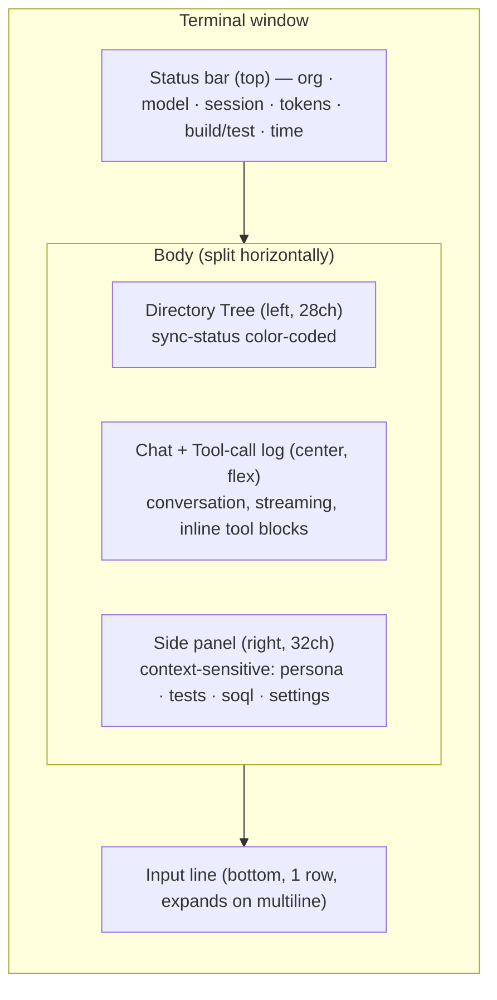
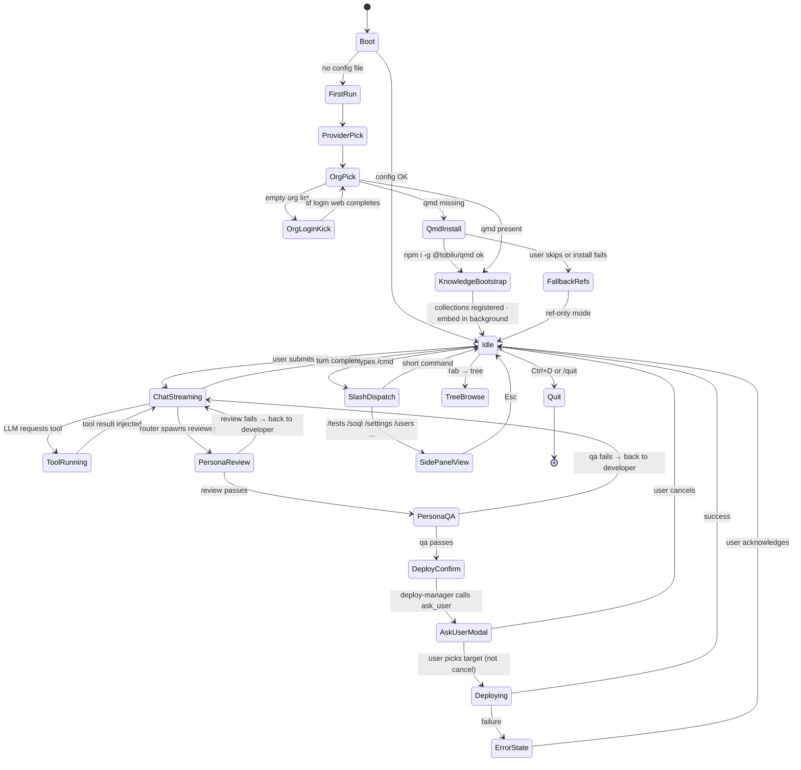

# Phase 3 — PoC (UI only)

Status: **complete**. Next: `phase-4-implementation.md`.

**No code**. This doc locks UX and visual semantics before any implementation.

---

## 1. Layout

Four panels. One always-visible status bar. No title bar (status bar serves that purpose).



Resize rules:

- Terminal < 100 cols → hide side panel; dir tree collapses to toggleable overlay (`Ctrl+B`).
- Terminal < 60 cols → hide dir tree too; chat full-width; side panel becomes modal drawer (`Ctrl+P`).

## 2. Panels

### 2.1 Status bar (top)

Single line. Segments separated by `·`. Order (left → right):

1. Logo/name: `sfwiz`
2. Org alias: `acme-scratch` (green if connected, yellow if stale session, red if unreachable)
3. LLM: `Sonnet 4.6` (dim prefix `anthropic`)
4. Session id short hash: `s:9f2c`
5. Tokens: `12.4k / $0.07`
6. Build: `✓ build` or `✗ build` or `⋯ build` (streaming icon while running)
7. Tests: `91%` or `✗ 3 failing`
8. Knowledge: `📚 ✓` (all 3 collections fresh) · `📚 ⋯` (embedding in progress) · `📚 !` (stale > 7d) · `📚 ref-only` (qmd absent; fallback active)
9. Time: `12:34`

Colors are semantic (§6). Icons use Unicode box-drawing + a minimal symbol set so colorblind users still parse state.

### 2.2 Directory tree (left)

Renders the SFDX project rooted at `force-app/` **plus** loose repo files (`README.md`, `package.json`, `docs/`, etc.).

Sync-status colors (per user spec):

| State | Color | Symbol | Meaning |
|-------|-------|--------|---------|
| Synced with org | green | `●` | Last deploy matches local content |
| Not synced (modified / added) | red | `◆` | Differs from org; needs deploy |
| Pending delete | red + strike | `✗` | Present in org, removed locally |
| Not in project (sf-ignored or loose) | white | `·` | Not tracked by SF (README, .gitignore, docs/) |
| Errored (conflict) | magenta | `!` | Local vs remote conflict |
| Retrieving / Deploying | cyan | spinner | In-flight |

Symbols always shown so colorblind users still see state.

**Source tracking data source**: `sf project deploy preview --json` + `sf project retrieve preview --json`. Cached in memory, refreshed on:
- TUI start (once)
- After any deploy/retrieve
- Manual `r` keybinding while tree focused
- File system watcher event (chokidar) for local changes

**Tree node layout**:

```
  force-app/
  ├ ● main/
  │   ├ ● default/
  │   │   ├ ● classes/
  │   │   │   ├ ● AccountHandler.cls
  │   │   │   └ ◆ OpportunityTrigger.trigger
  │   │   └ ● lwc/
  │   │       └ ◆ oppForecast/
  │   │           ├ ◆ oppForecast.js
  │   │           ├ ◆ oppForecast.html
  │   │           └ ◆ oppForecast.js-meta.xml
  ·  config/
  ·  docs/
  ·  README.md
```

Hotkeys (tree focused): `↑/↓` move, `→` expand, `←` collapse, `Enter` preview in chat panel or open in external editor, `d` request deploy of node, `r` refresh, `/` filter, `Space` mark for multi-deploy.

### 2.3 Chat + tool-call log (center)

Streaming chat buffer. Three kinds of blocks, top to bottom:

1. **User message** — indent 0, prefix `❯`.
2. **Assistant text** — indent 0, streamed word-by-word. Markdown rendered inline (headings, code fences, lists).
3. **Tool call block** — collapsible, default collapsed when complete:
   ```
   ▸ sf_query (done · 340ms)  SELECT Id,Name FROM Opportunity LIMIT 10 → 10 rows
   ```
   Expanded:
   ```
   ▾ sf_query (done · 340ms)
     args   { query: "SELECT Id,Name FROM Opportunity LIMIT 10" }
     result [ { Id: "006…", Name: "Acme Bid" }, … 9 more ]
   ```

Persona transitions appear as a dim inline divider:

```
── persona → developer ──────────────────
```

Keybindings inside chat: `Enter` focus input, `PgUp/PgDn` scroll, `Ctrl+L` clear screen (history kept), `Tab` cycle focus, `o` on focused tool-call → open in side panel with full payload.

### 2.4 Side panel (right)

Context-sensitive. Views:

| View | Trigger | Contents |
|------|---------|----------|
| Persona | always default | Current persona + next planned + phase history (design → develop → review → qa → deploy) with status badges |
| Tests | `/tests` or after `sf_run_tests` | Class list, pass/fail counters, coverage %, error drill-down |
| SOQL | `/soql` | Query editor (multi-line) + result grid (first 50 rows) + `→` to paginate |
| Settings | `/settings` | 42-type registry as tree; preview diff on focus; deploy gesture |
| Users | `/users` | User list with filters; CRUD gestures (gated by permission) |
| Metadata | `/retrieve` or tree-node action | Retrieve in progress + ZIP inventory |
| Deploy report | after deploy | Changed files, test outcomes, elapsed, org URL |
| Agent viewer | opening `.agent` file | Parsed tree, props, tools, guard rails (read-only in v1) |
| Tokens | `/tokens` | Session token breakdown per persona, cost estimate |
| Knowledge | `/knowledge` | Per-collection card: name, size, chunk count, last scrape, last embed, next scheduled run, "refresh" gesture. Surfaces fallback state when qmd absent. |
| Learn log | `/learn status` | Tail of `~/.sfwiz/learn.log`; shows worker state (idle/running/paused/error), per-page diff counters for the most recent run. |

Default side-panel = **Persona**. Switch via `F2…F9` or `Ctrl+1…9`.

### 2.5 Input line (bottom)

Single line by default. Grows up to 10 rows on multi-line paste / `Shift+Enter`. Slash-command autocomplete pops a floating menu above the input. `@` triggers file-path autocomplete. `#` captures a memory note.

## 3. Keybindings (Claude Code parity + extensions)

Global:

| Key | Action |
|-----|--------|
| `Enter` | submit input (chat or dialog) |
| `Shift+Enter` | newline in input |
| `Ctrl+C` once | cancel current agent/tool run |
| `Ctrl+C` twice within 1.5 s | quit TUI |
| `Ctrl+D` | quit if input empty |
| `Ctrl+L` | clear visible chat (history retained) |
| `Ctrl+R` | reverse history search |
| `Ctrl+P` | command palette (fuzzy slash-commands) — also opens when typing bare `/` at position 0 of an empty input |
| `Shift+Tab` | cycle permission mode: `ask → auto-edit → yolo` |
| `Ctrl+B` | toggle directory tree |
| `Tab` | cycle focus: input → tree → chat → side panel (spec — PoC input is always focused for now; focus cycle lands in M5) |
| `Esc` | dismiss overlay / unfocus |
| `F1` | help overlay |
| `F2…F9` | side-panel views |
| `/` at start of input | slash-command mode |
| `@` in input | path autocomplete |
| `#` in input | memory note |

Tree-focused keys: see §2.2.

Chat-focused keys: see §2.3.

Chord timeout: 800 ms (configurable in `~/.sfwiz/config.json`).

## 4. State machine



## 5. Failure and edge states (mockups)

### 5.0 `ask_user` inline modal

Centered over chat; dimmed backdrop; blocks input. Rendered when LLM calls `ask_user` tool.

```
┌── persona: deploy-manager ─────────────────────────────┐
│                                                         │
│  Deploy target?                                         │
│                                                         │
│  ● Scratch org (acme-scratch)                           │
│  ○ Existing org (acme-uat) — prod-adjacent              │
│  ○ Local only (validate, don't deploy)                  │
│  ○ Cancel                                               │
│                                                         │
│  preview ──────────────────────────────────────────────│
│   sf project deploy start \                             │
│     --target-org acme-scratch \                         │
│     --test-level RunLocalTests                          │
│                                                         │
│  ↑/↓ select  ·  Enter confirm  ·  Esc cancel  ·  n note │
└─────────────────────────────────────────────────────────┘
```

- Single-select default; multiSelect toggles checkboxes.
- `n` key opens inline note field; note travels with tool-result.
- Modal dismisses on Enter (tool-result = selected) or Esc (tool-result = `{ selected: 'cancel' }`).
- Rendered by opentui `<box borderStyle="rounded">` + hand-rolled fuzzy-select list (same pattern as `CommandPalette` in `src/poc.tsx`).
- Tool-call block in chat afterwards renders: `▾ ask_user (done · Scratch org)`.

Runtime gate (§risks): destructive SF tools refuse to run unless a matching `ask_user` result (non-cancel) exists in the last N turns. Gate message appears as a tool-result to the LLM, not in the modal.

### 5.1 Empty org list

Side panel (Persona view) shows:

```
No Salesforce orgs connected.

[1] Run `sf login web`  (Enter)
[2] Enter username/password
[3] Skip for now
```

Main chat shows: "`No orgs yet. sfwiz will open your browser to authenticate — press Enter when ready.`"

### 5.2 Provider unreachable

Status bar: `Sonnet 4.6` segment turns red, suffix `· offline`. Chat streams: `LLM provider unreachable. Check network or run /provider to switch.` Input remains editable; slash-commands that don't need LLM still work (`/orgs`, `/tests`, `/soql`, `/settings`).

### 5.3 Rate limit

Tool-call block styled as warning:

```
▾ anthropic.stream (rate-limited · retry in 12s)
  waiting — press Ctrl+C to cancel
```

Exponential backoff with visible countdown. Auto-retry up to 3 attempts.

### 5.4 Deploy failure

Side panel switches to "Deploy report" view:

```
Deploy FAILED · 2.3s

3 errors
  ✗ OpportunityTrigger        Line 14  Apex compile error: unknown field IsWon__c
  ✗ OppHandler                Line 42  Unused import
  ✗ (permission)              Missing PermissionSet OppForecaster

Press  r  to retry  ·  d  to drop changes  ·  o  to open report
```

Tree updates: failing files stay red + exclamation glyph.

### 5.5 Test failure

Tests side panel:

```
Apex tests — 12 run · 9 pass · 3 fail · cov 72%

✗ OppHandler_Test.updateIsWon          System.DmlException
✗ OppHandler_Test.bulkUpdate           Assertion failed
✗ OppFlow_Test.coverageOnly            coverage 38% (< 75%)

Router will re-dispatch to developer. (auto)
```

### 5.6 Reviewer rejects

Chat renders reviewer output as structured block:

```
▾ reviewer (issues · 2 critical · 1 info)
  critical  OpportunityTrigger:18   FLS not enforced before DML
  critical  OppHandler:44           SOQL inside for loop
  info      LWC oppForecast         Consider @wire instead of imperative Apex

Re-dispatching to developer…
```

### 5.7 Streaming cancelled

`Ctrl+C` mid-stream:

```
 ⛔ cancelled  (partial response discarded)
```

Conversation state rolls back to pre-turn snapshot.

### 5.8 Config corrupt

Boot-time. TUI shows modal:

```
⚠ ~/.sfwiz/config.json parse error at line 7
  Recover with defaults? (y/N)
```

### 5.9 Knowledge states

Knowledge-segment in status bar renders one of:

- `📚 ✓` — all 3 collections embedded + fresh (< 7d)
- `📚 ⋯ embedding 43%` — qmd embed running in background (progress from qmd stderr parse)
- `📚 scraping apex-ref…` — scraper worker active
- `📚 stale (3d apex-ref, 9d lwc-guide)` — amber; suggest `/learn refresh`
- `📚 ref-only` — qmd absent; personas route to bundled `resources/references/*.md`
- `📚 ✗ learn error` — red; expand side panel for stack trace

Expanded Knowledge panel on `/knowledge`:

```
Knowledge collections

 apex-ref     ● fresh    812 chunks  9.6 MB   last scrape 14h ago   next scrape 03:00
 lwc-guide    ⋯ embedding  218 chunks  2.7 MB   last scrape 14h ago   embed 43%
 sf-releases  ● fresh (3 seasons)
   ├ spring-26   61 chunks   1.8 MB
   ├ summer-26   84 chunks   2.3 MB
   └ winter-26   59 chunks   1.7 MB

 Worker: running (daily 03:00)    press  R  to refresh all   P  to pause
```

Failure variant (qmd missing):

```
Knowledge  —  qmd not detected

 sfwiz can install qmd (@tobilu/qmd, ~30 MB) and download the 3
 knowledge collections (~20 MB total). This unlocks deeper answers
 from the Apex reference, LWC guide, and latest Release Notes.

 [1] Install qmd now  (Enter)       [2] Use bundled refs only (N)
```

### 5.10 Loading / long-running

Four distinct visible states — never a silent wait.

1. **LLM thinking** (post-user-send, pre-first-token). Shown as a dim `▍ thinking… Ns` line immediately below the user message with an inline `Equalizer` loader (see below). Replaced inline by the first streamed token. Reason: Anthropic streams can stall several seconds on extended-thinking Opus turns — silence looks hung.
2. **LLM streaming** (tokens arriving). No loader; caret pulses at stream tail. Elapsed tick every second if stream pauses > 2 s.
3. **Tool running**. 3-state block: `pending` (faint, queued) → `running` (`Equalizer` + elapsed + tool name + 1-line summary of args) → `done` / `error` (collapsible). Even cached hits flash a 120 ms `(cached)` indicator so users know something happened.
4. **Deploy / retrieve / long SF ops**. Same 3-state block, but with secondary progress — `sf project deploy start --json` streams component counts; render `42 / 198 components` + percent bar inside the tool block. Cancel via `Ctrl+C` hits `AbortController`, which kills child + sends `sf project deploy cancel` when a deploy ID exists.

Knowledge bootstrap + `/learn refresh` use the status-bar progress bar from §8a, not a tool-call block.

**Equalizer loader** (locked): 9 vertical bars (`▁▂▃▄▅▆▇█`), 130 ms tick, each bar does a ±2 random walk clamped to `[0, 7]`. Single-line, bold `INFLIGHT` blue. Stays in place (no bouncing motion — a prior cloud-sprite design bounced and was rejected as distracting). Reduced-motion path replaces the bar row with a plain ` …` ellipsis. Reference implementation: `Equalizer` component in `src/poc.tsx`.

## 6. Color + theme

| Role | Light theme | Dark theme |
|------|-------------|------------|
| Text (primary) | `#1f2328` | `#e6edf3` |
| Text (dim) | `#656d76` | `#7d8590` |
| Sync ok | `#1a7f37` | `#3fb950` |
| Sync dirty / error | `#cf222e` | `#f85149` |
| Sync in-flight | `#0969da` | `#58a6ff` |
| Conflict | `#8250df` | `#bc8cff` |
| Warning | `#bf8700` | `#d29922` |
| User input prefix `❯` | accent | accent |
| Persona divider | dim | dim |

Symbols accompany every color so state stays legible without color.

Themes follow terminal appearance when detectable; override via `/theme`.

## 7. Accessibility

- All colors have symbol backup.
- `reducedMotion: true` disables spinners (shows plain `…`).
- Status-bar segments announced on focus change for screen-readers (planned: plain-text fallback segment that opentui emits outside the diffed render region — TBD in M5).
- Keyboard-only usable (no mouse required).
- `--plain` CLI flag → strip ANSI + animation, suitable for SSH / CI.

## 8. First-run setup wizard (UX)

Sequence the TUI walks through on first launch. Steps 0-1 run **every launch in an un-trusted workspace**; steps 2-7 run only once per machine.

0. **Trust workspace** (per-cwd; blocks TUI until answered). Full-screen prompt — no dim chat behind, since nothing should render before trust is established.
   ```
   Accessing workspace:

     <absolute cwd>

   Quick safety check: Is this a project you created or one you trust?
   (Your own code, a well-known OSS project, or work from your team.)
   If not, take a moment to review what's in this folder first.

   sfwiz will be able to read, edit, and execute files here.

   ❯ 1. Yes, I trust this folder
     2. No, exit

   Enter to confirm · Esc to cancel
   ```
   - Trust persisted in `~/.sfwiz/trusted-workspaces.json` keyed by realpath of cwd. Schema: `{ path, firstTrustedAt, lastSeenAt }`.
   - If unanswered and user exits (`Esc` / `Ctrl+C`) → process exits code 0, nothing written.
   - Re-prompt on every launch in cwds not in the trust list.
   - `--trust-this-workspace` CLI flag trusts non-interactively (for CI / wrapper scripts).
   - **Not a sandbox.** Strictly a human speedbump against `cd /tmp/random-repo && sfwiz` footguns. Runtime file-op gates still apply (§9).
1. **Welcome** — `sfwiz` banner + 1-screen "what it does". `Enter` to continue.
2. **Provider pick** — list detected env vars (`ANTHROPIC_API_KEY`, `OPENAI_API_KEY`, `GOOGLE_API_KEY`, `GROQ_API_KEY`) + "local / OpenAI-compatible". Arrow + Enter. If none, prompt to paste one.
3. **Model pick** — default per provider (Sonnet 4.6 for Anthropic). `Tab` to alt list.
4. **Org pick** — runs `sf org list --json`. If non-empty, list with aliases + type badges (prod/sandbox/scratch). Empty → prompts `sf login web` in-terminal.
5. **Knowledge bootstrap**:
   - Detect qmd: `which qmd`.
   - If missing → AskUserQuestion modal: install qmd + download collections (~50 MB disclosed up-front) vs ref-only mode.
   - If installed or just installed → register 3 collections with empty dirs, kick off scraper workers for each collection (parallel) + background embed. TUI usable immediately.
   - Embed runs in Bun Worker; main TUI does not block. Status-bar segment tracks progress (see §5.10 + §8a).
6. **Permission mode** — pick default:
   - `ask` (default, Claude-Code-like) — prompt per file-op / shell / out-of-cwd fetch.
   - `auto-edit` — auto-approve edits + creates inside cwd; still prompt for deletes, shell, out-of-cwd fetch, and destructive SF ops.
   - `yolo` — auto-approve everything except destructive SF ops (deploy-to-prod, permset-in-prod). Warns that destructive SF gate cannot be disabled. Saved to `config.permissionMode`.
   - Toggle any time via `/permissions` or `Shift+Tab` cycle in chat.
7. **Continuous learning opt-in** — checkbox-style multi-select confirms daily 03:00 schedule + per-collection inclusion. Default: all on.
8. **Done** — drops into main TUI. Side panel = Persona. Tip-of-the-day overlay (dismiss with `Esc`).

All steps reversible with `←`; cancel with `Ctrl+C`. Wizard state saved partially so relaunch resumes. Step 0 is **not** a wizard step — it gates every launch in any un-trusted cwd, even after the main wizard is done.

## 8a. Knowledge bootstrap progress (locked)

Closes phase-3 §9 open question "Scraper progress granularity". Decision: **aggregate percent + tailing current item**.

While scraper + embed workers run during first-run step 5, the status bar shows a single-line progress block:

```
Knowledge  ████████░░░░░░░░  48%  apex-ref · Database.update (117 / 243)
```

- Left: unicode block bar (`█`/`░`), 16 cells.
- Middle: aggregate % across all active collections (total docs scraped+embedded ÷ total expected).
- Right: current collection + current-item head (truncated to fit terminal width) + `(done / total)` counter.
- Colors: accent while running, dim while paused, warning on per-item error (individual errors do not abort; summary shown on completion).
- Updates ≤ 10 Hz (coalesced); `reducedMotion: true` strips the bar to `Knowledge  48%  scraping…`.
- Main chat + input remain fully usable; agent loop tolerates `knowledge: embedding` state (qmd falls back to BM25 until embeddings land, per phase-2 §mitigations).

Same component renders during `/learn refresh` and daily worker runs.

## 9. Open questions for phase-4

- Debounce interval for tree refresh vs. filesystem events? (50 ms?)
- Should tool-call blocks default to collapsed while running or expanded? (Currently: expanded while running, collapse on done.)
- Persona divider vs. banner — which reads better in long sessions?
- ~~Command palette (`Ctrl+K`) — include `@file` and `#memory` shortcuts, or keep palette slash-only?~~ **LOCKED** slash-only; `@` and `#` stay inline in chat input. See §10.
- What happens if user switches org mid-turn? Hard-stop loop? Warn and continue?
- **Knowledge freshness badge** — how loud? (amber at 3d? 7d? Only user-configurable?)
- ~~**Scraper progress granularity** — show per-URL ticker, or aggregate percent only?~~ **LOCKED** aggregate % + tailing current item. See §8a.
- ~~**First-run total size warning** — disclose ~50 MB knowledge download before consenting?~~ **LOCKED** yes, disclosed in step 5 AskUserQuestion modal (see §8).

## 10. Command palette UX (Ctrl+P or bare `/`)

Crush-style modal. Centered over chat (no layout reflow); dim overlay outside. Fuzzy-filtered list of all registered slash commands + a small curated set of toggles that are awkward as slash commands (Enable Thinking, Disable Notifications, Toggle Yolo, Toggle Help, Init Project, Disable Background Color, Quit).

```
┌─ Commands ─────────────────────────────────────────────┐
│                                                         │
│ ❯ type to filter                                        │
│                                                         │
│   New Session                                    Ctrl+N │
│ █ Sessions                                       Ctrl+S │
│   Switch Model                                   Ctrl+L │
│   Enable Thinking Mode                                  │
│   Toggle Yolo Mode                                      │
│   Toggle Help                                    Ctrl+G │
│   Quit                                           Ctrl+C │
│                                                         │
│ tab switch · ↑/↓ choose · enter confirm · esc cancel   │
└─────────────────────────────────────────────────────────┘
```

- Keys: `↑/↓` move; `Enter` run; `Esc` close; `Tab` switches between "Commands" and "Files" / "Memory" sub-views (v2 — v1 is single-view).
- Fuzzy matcher: subsequence match, score by consecutive-char bonus + prefix bonus. No external dep.
- Each entry: `label` + optional right-aligned accelerator; rows with a visible keybinding are also bindable directly without opening the palette.
- Palette is **slash-only in terms of command vocabulary** — entries map 1-1 to registered `/command` handlers or config toggles. `@file` pathing and `#memory` notes remain in the chat input to keep conceptual cleanliness.
- Implementation: `src/tui/overlays/CommandPalette.tsx` (phase-4 M4/M15). State driven by dispatcher's command registry so adding a slash command auto-populates the palette.
