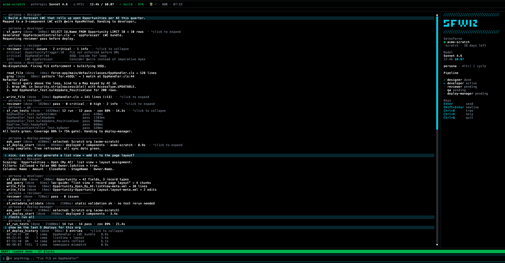

<p align="center">
  
</p>

```
 ███████╗███████╗██╗    ██╗██╗███████╗
 ██╔════╝██╔════╝██║    ██║██║╚══███╔╝
 ███████╗█████╗  ██║ █╗ ██║██║  ███╔╝
 ╚════██║██╔══╝  ██║███╗██║██║ ███╔╝
 ███████║██║     ╚███╔███╔╝██║███████╗
 ╚══════╝╚═╝      ╚══╝╚══╝ ╚═╝╚══════╝
 Salesforce × Claude — terminal-native AI harness
```

**sfwiz** is a Claude-Code-style interactive TUI harness for the Salesforce ecosystem — built for Apex developers, LWC engineers, and Salesforce admins who want AI-assisted workflows without leaving the terminal.

> Hackathon project — powered by Anthropic Claude.

## Demo



## Architecture

- **Orchestrator** (`@anthropic-ai/sdk` `messages.stream()`): streaming tool-use with manual dispatch.
- **6 persona subagents** (`@anthropic-ai/claude-agent-sdk` `query()`): org-admin · designer · developer · deploy-manager · reviewer · qa. Each runs as an isolated subagent with its own tool-scope and model (Opus 4.7 for reviewer + designer; Sonnet 4.6 for the rest). Structured JSON returned via the final `result` message is injected back into the orchestrator as a tool-result.
- **Tools**: filesystem (read/edit/write/grep), shell, jsforce (SOQL/describe), `sf` CLI (deploy/scratch/permset/retrieve/tests/apex), and `ask_user` for confirmations.
- **Continuous-learn worker** (Bun Worker, opt-in): daily scraper → qmd embed of Apex reference, LWC guide, and Salesforce release notes.
- **Prompt caching**: 4-breakpoint strategy — system block, last tool-def, stable history prefix, last assistant turn.
- **Safety**: destructive Salesforce ops (`sf_deploy_start` / `sf_scratch_create` / `sf_assign_permset`) are runtime-gated behind a mandatory `ask_user` confirmation regardless of permission mode.

> **Status:** hackathon submission build (v0.1.0). Round-2 E2E PASS — see `E2E-Test-Result.MD`.

## Quickstart

### Prerequisites

- [Salesforce CLI (`sf`)](https://developer.salesforce.com/tools/salesforcecli) logged in (`sf login web`)
- An Anthropic API key (set inside the TUI — see below)
- For source builds: [Bun](https://bun.sh) 1.1+

### Run from release binary (macOS Apple Silicon)

```bash
# Download + verify checksum
curl -L -o sfwiz https://github.com/arufian/sfwiz/releases/download/v0.1.0/sfwiz-darwin-arm64
curl -L -O https://github.com/arufian/sfwiz/releases/download/v0.1.0/sfwiz-darwin-arm64.sha256
mv sfwiz sfwiz-darwin-arm64
shasum -a 256 -c sfwiz-darwin-arm64.sha256

# Make executable + launch
mv sfwiz-darwin-arm64 sfwiz
chmod +x sfwiz
./sfwiz --first-run
```

Optional — install globally:

```bash
sudo mv sfwiz /usr/local/bin/sfwiz
sfwiz --first-run
```

> Only `darwin-arm64` ships as a prebuilt binary (Bun cross-compile is blocked by `@opentui/core` dynamic-import resolution). Other platforms must build from source.

### Run from source

```bash
git clone https://github.com/arufian/sfwiz.git
cd sfwiz
bun install
./run_sfwiz.sh           # builds dist/sfwiz on first run, then launches
# or, for live-reload dev:
bun scripts/dev.ts
```

### Set the API key (inside the TUI)

On first launch sfwiz prompts for an Anthropic API key — paste it and press
Enter. The key is saved to `~/.sfwiz/config.json` (chmod 600, owner-only).
No `.env` file, no shell variable to export.

To change the provider or rotate the key later:

- Open the command palette (`Ctrl+P`) and run `/provider` (alias `/api-key`).
- Pick **Anthropic** (more providers come in v2).
- Paste a new key starting with `sk-ant-…` or `sk-proj-…`.

The TUI rejects malformed keys and clears the saved value if it ever gets
corrupted, so a stale config can never silently boot the agent loop.

## Features

| Area | Commands / UI |
|---|---|
| Orgs | `/orgs` — list authenticated Salesforce orgs |
| Login | `/login` — authenticate a new Salesforce org |
| Knowledge | `/knowledge` (alias `/kb`) — manage knowledge base (qmd) |
| Learn | `/learn` — control continuous learning worker |
| Permissions | `/permissions` — view or change permission mode (ask / auto-edit / yolo) |
| Sessions | `/sessions` — browse and resume prior sessions |
| Model | `/model` — switch active Claude model |
| Provider | `/provider` (alias `/api-key`) — choose LLM provider, paste API key inside TUI |
| Help | `/help` — show keybindings and commands |
| Quit | `/quit` (alias `/exit`) — exit sfwiz |
| Command palette | `Ctrl+P` — fuzzy-search commands + toggles |
| Tool surface (LLM-driven) | Apex anonymous, SOQL/describe, deploy/retrieve, scratch create, permset assign, run tests |

## Keyboard shortcuts

| Key | Action |
|---|---|
| `Ctrl+P` | Command palette |
| `Ctrl+W` | Trust workspace |
| `Shift+Tab` | Cycle permission mode (ask → auto-edit → yolo) |
| `Ctrl+B` | Toggle directory tree |
| `Ctrl+Q` | Quit |

## Build from source

```bash
# Current platform binary → dist/sfwiz
bun scripts/build.ts

# All platforms
bun scripts/build.ts --all

# JS bundle (for debugging)
bun scripts/build.ts --bundle
```

## Project structure

```
src/
  cli.ts           Entry point (argv → TUI)
  agent/           Orchestrator loop + subagent dispatcher + cache hints
  config/          Config schema + first-run wizard + trust
  dispatcher/      Command registry + slash-command handlers
  knowledge/       qmd integration + collection bootstrap
  learn/           Background worker + scheduler + event bus
  personas/        Persona registry + gate
  scraper/         HTML→Markdown adapters + season detection
  sf/              @salesforce/core auth + jsforce connection
  tools/           All tool definitions (SF CLI + jsforce + system)
  tui/             OpenTUI/React views, overlays, layout
  util/            Fuzzy search + async utilities
resources/
  personas/        Persona prompt files (Markdown)
  references/      10 Salesforce reference guides
scripts/
  build.ts         bun build --compile wrapper
  dev.ts           Watch + restart for development
```

## License

Apache-2.0 — see [LICENSE](LICENSE).
