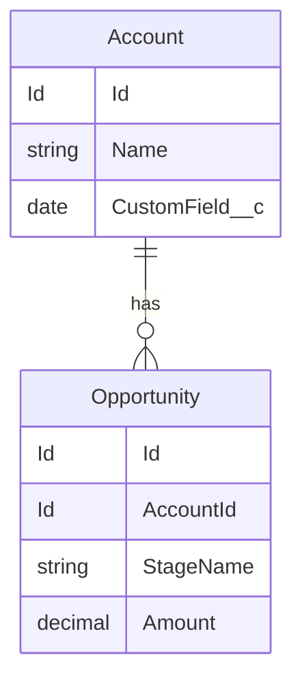
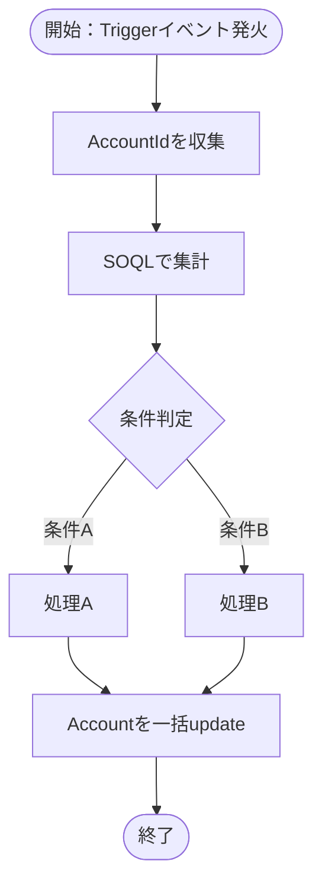
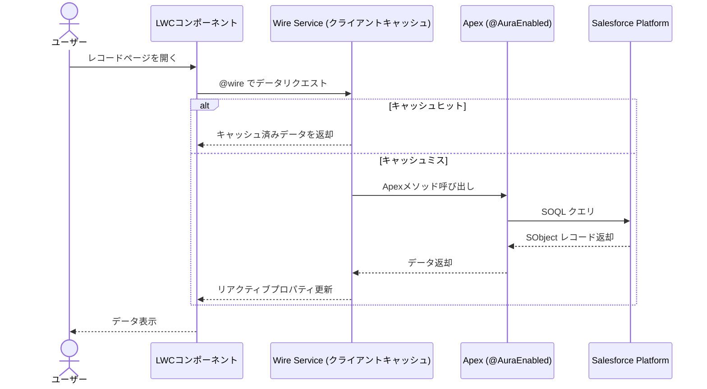

# 設計書テンプレートとガイドライン

## 設計書の内容テンプレート

```markdown
## 設計書：[フィーチャー名]

### 1. データモデル

| オブジェクト | 項目名 | API名 | 型 | 説明 |
|---|---|---|---|---|

**ER図（Mermaid）**



### 2. 処理フロー図

処理の全体像をフロー図で示す。



### 3. Trigger設計
- Trigger名：（例：OpportunityTrigger）
- Handler名：（例：OpportunityTriggerHandler）
- トリガーイベント：（例：after insert, after update）
- ロジック概要：

### 4. LWC設計
- コンポーネント名：
- データ取得方式：（wire / imperative）
- 表示する項目：
- イベント・操作：

### 5. メタデータ要件
- カスタムオブジェクト/項目：
- ページレイアウト：（カスタムオブジェクトを作成する場合は必須 — 全カスタム項目を配置したレイアウトを設計する）
- カスタムタブ：（カスタムオブジェクトにUIアクセスが必要な場合）
- カスタムアプリケーション：（タブをアプリケーションメニューに表示する場合）
- Permission Set：（カスタム項目のRead/Write権限、アプリケーション可視性、タブ可視性を含める）
- フロー：
- 入力規則：

### 6. Permission Set・ページレイアウト設計（カスタムオブジェクトを含む場合は必須）

カスタムオブジェクトを新規作成する場合、項目を定義するだけではUIに表示されない。以下を必ず設計に含めること：

- **Permission Set** — すべてのカスタム項目にRead/Write権限を明示的に付与する。Required項目はプロファイルレベルで自動付与されるためPermission Setでは設定不要
- **ページレイアウト** — すべての必要項目を配置する。デフォルトレイアウトにはカスタム項目が含まれないため、カスタムレイアウトの作成が必須
- **カスタムタブ** — オブジェクトへのナビゲーションに必要
- **カスタムアプリケーション**（任意） — タブをグルーピングしてアプリケーションランチャーに表示する場合
- **アプリケーション可視性** — Permission Setでアプリケーションの可視性も設定する
```

## ユーザーインタラクション シーケンス図（LWCが含まれる場合）

Salesforceアーキテクトの視点で、Salesforceプラットフォーム固有の参加者名を使うこと。「Salesforce DB」「バックエンド」「サーバー」は使わない。

**重要：LDS（Lightning Data Service）と Wire Service の区別**
- **LDS** → `getRecord` / `getRecords` / `getObjectInfo` など **標準Wireアダプター** のみ
- **Wire Service（クライアントキャッシュ）** → カスタム `@AuraEnabled` Apex メソッドへの `@wire` 呼び出し
- LDSをカスタムApexの @wire に使うのは**誤り**



### シーケンス図の参加者名に関する注意

| 使わない | 代わりに使う | 理由 |
|---|---|---|
| Salesforce DB / DB | Salesforce Platform | SalesforceにはRDBMS的な「DB」は存在しない。プラットフォーム全体を指す |
| バックエンド / サーバー | Apex | Salesforceのサーバーサイド実行環境はApexランタイム |
| LDS（カスタムApex @wireの場合） | Wire Service | LDS（Lightning Data Service）は `getRecord`/`getRecords` 等の標準Wireアダプター専用。カスタムApexの `@wire` にはLDSという用語を使わない |

## 設計時に検討すべきアーキテクチャ観点

設計書では、以下の観点について要件に応じた判断を記載すること。すべてが毎回必要なわけではないが、該当する場合は明示的に設計判断を書く。

| 観点 | 設計で決めること |
|---|---|
| **Apexセキュリティモデル** | `with sharing` / `without sharing` / `inherited sharing` の選択理由。CRUD/FLSチェック方式の選択（`Schema.sObjectType.<Object>.isAccessible()` / `WITH SECURITY_ENFORCED` / `WITH USER_MODE` / `Security.stripInaccessible()`）。集計クエリ（`COUNT()`/`SUM()`等）に `WITH SECURITY_ENFORCED` を使うと権限不足時にクエリ自体が例外になるため、集計の場合は明示的なスキーマチェック + `with sharing` を推奨 |
| **Org依存値の回避** | ピックリスト値（`Status = 'Open'` 等）はOrg設定で変わるため、ブール標準項目（`IsClosed`, `IsWon` 等）やカスタムメタデータで定義した値を優先する |
| **権限エラー時のUX** | 権限不足時の挙動を明示する。グレースフルデグレード（`0` や `—` を返す）か、明示的エラー（`AuraHandledException` でユーザーに通知）か。一貫させる |
| **キャッシュ戦略**（LWCの場合） | `cacheable=true` を使う場合、データ鮮度の要件とリフレッシュ手段を明記する。手動 `refreshApex()` / CDC + `lightning/empApi` / Platform Events のどれを採用するか |
| **スケーラビリティ** | 大量データが見込まれる場合、リアルタイムクエリ vs マテリアライズドフィールド（Trigger + 非同期更新：`Queueable`/`Batchable`/CDC）のトレードオフを検討する |
| **エラーハンドリング方針** | LWC向けApex: `System.debug()` でサーバーサイドログ + `AuraHandledException` でユーザーフレンドリーなメッセージ。`ex.getMessage()` をそのままユーザーに返さない。Trigger/Batch: `addError()` やプラットフォームイベントで通知 |
| **テスト設計の要点** | `System.runAs()` で権限パターンをテスト。バルクテスト（200件）。正常系・異常系・境界値。アクセシビリティ（`aria-label` 等） |

## LWC命名規則

| 観点 | ルール |
|---|---|
| コンポーネントフォルダ名・ファイル名 | **camelCase**（例：`accountOpenCaseBadge`）— Salesforce LWCの正式規則 |
| HTMLテンプレートでの参照 | **kebab-case + `c-` プレフィックス**（例：`<c-account-open-case-badge>`）— フォルダ名がcamelCaseでも参照時は自動的にkebab-caseになる |

## 図の作成ルール

- データモデルのある設計書には必ずER図（`erDiagram`）を含めること
- Trigger・フロー・自動化を含む場合は必ず処理フロー図（`flowchart TD`）を含めること
- LWCを含む場合は必ずユーザー・LWC・Apex・Salesforce Platformの関係を示すシーケンス図（`sequenceDiagram`）を含めること
- 図はMermaid記法で書き、マークコードブロック内に記述すること（GitHubやNotionでそのまま表示可能）
